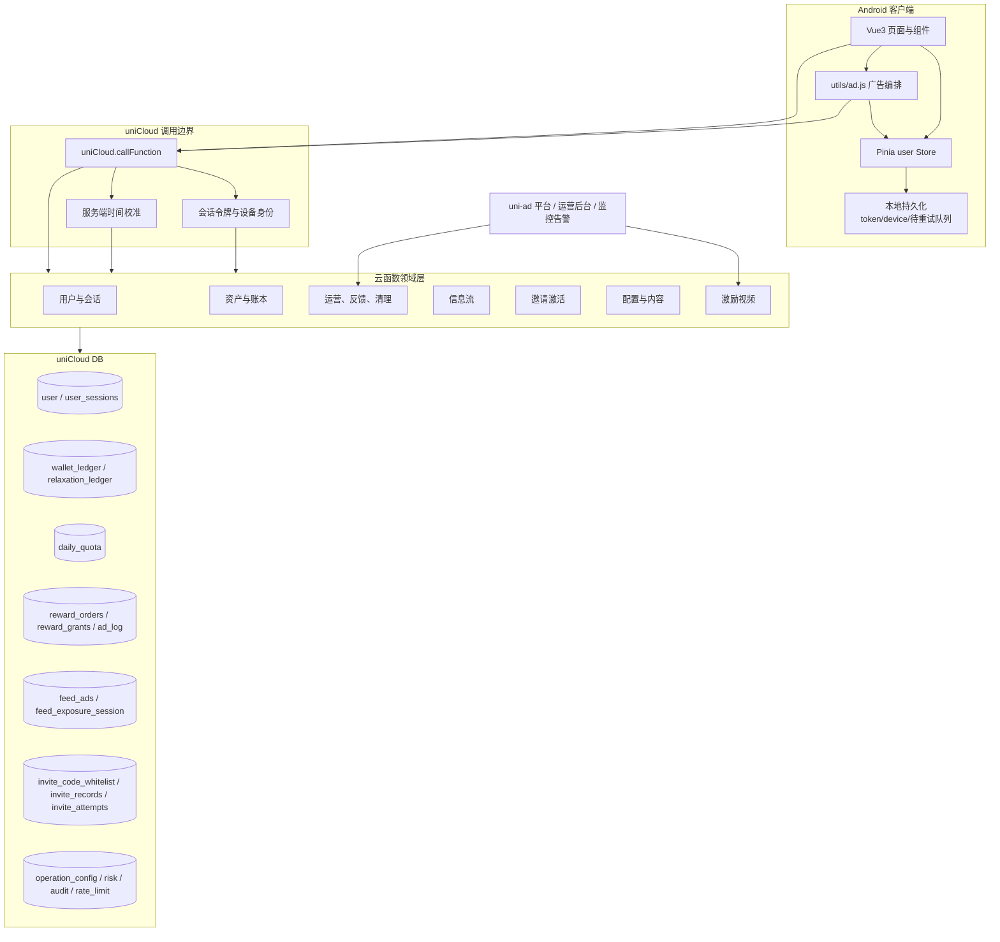
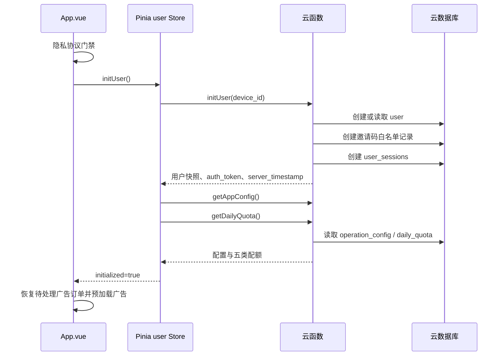
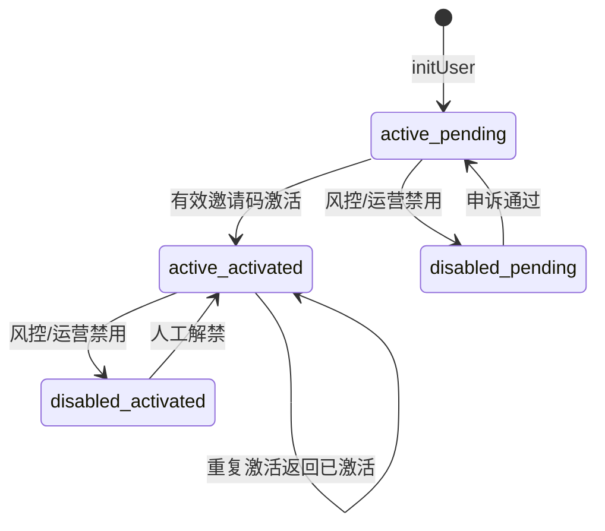
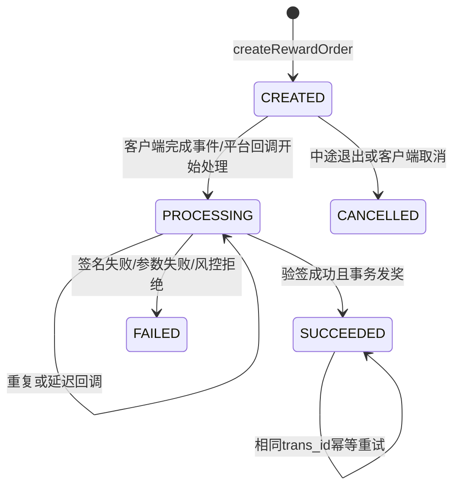
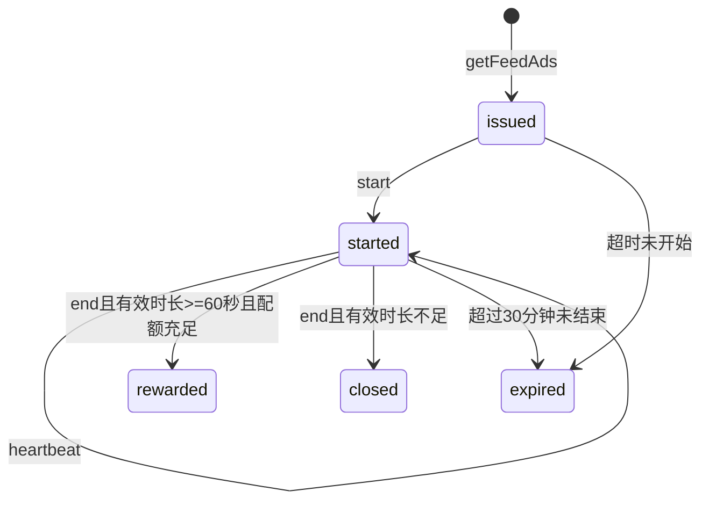
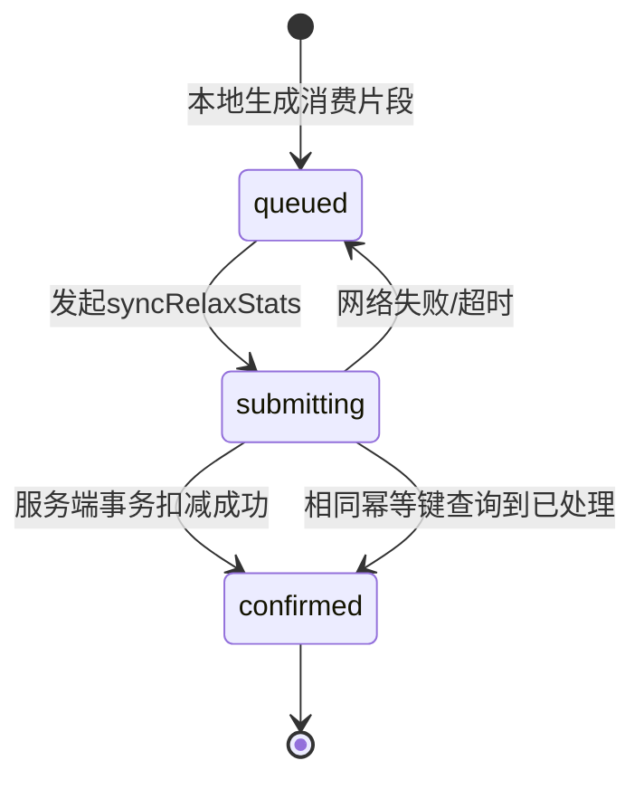
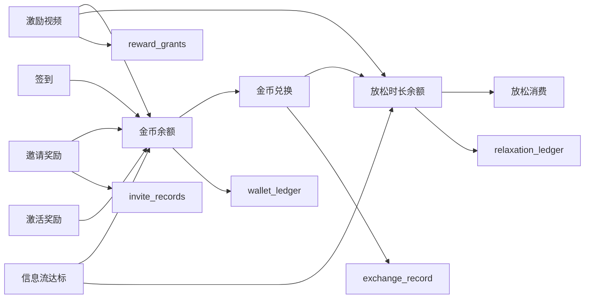
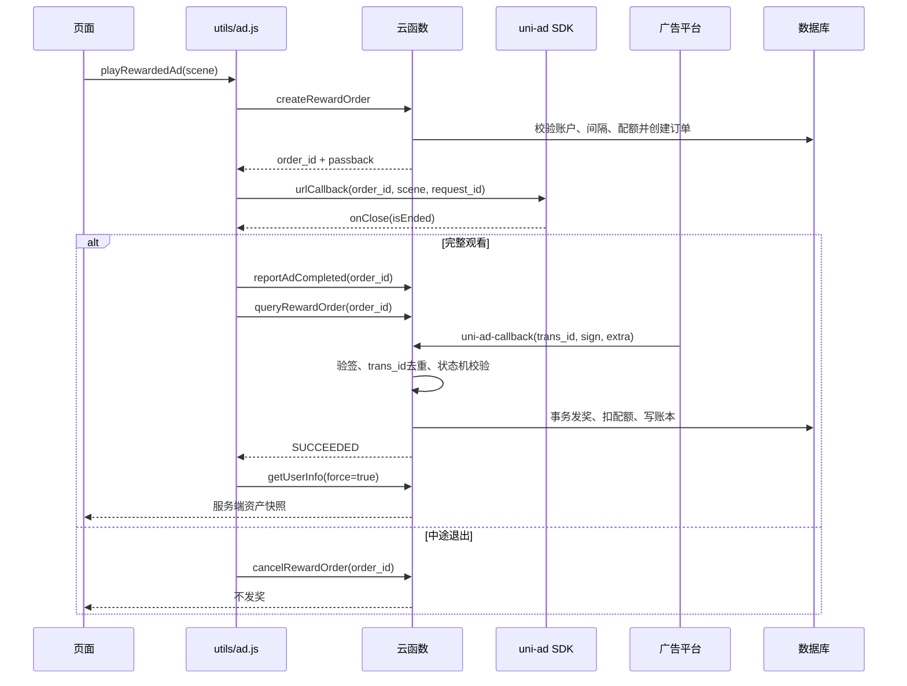

# 片刻应用最终端到端架构版

**版本**：Final Architecture v1.0  
**适用平台**：Android / uni-app + Vue 3 + Pinia + uniCloud-Alipay  
**适用角色**：产品、UI、客户端、云函数、数据库、测试、运营、运维和发布人员  
**架构基线**：以《片刻应用业务逻辑、上下游关系与UI设计指导书 v1.0》为产品规则基线，并以当前仓库中的客户端和 `uniCloud-alipay` 实现为工程基线。[1]

> **最终原则**：客户端负责体验，Pinia 负责状态编排，API 负责业务边界，云函数负责裁决，云数据库负责持久化，账本负责审计，状态机负责恢复，配置中心负责运营变化，测试与运维负责上线后的可验证性。

---

## 1. 产品闭环与架构目标

片刻是一款以“放松时长”为核心资产的沉浸式 Android 应用。用户通过激活账户、每日签到、观看激励视频、完成信息流曝光和邀请好友获得金币及放松时长；金币可以兑换放松时长，放松时长在放松页被服务端校准后逐段消耗。产品由“领金币页—我的页—放松页”组成内部经济闭环，由“邀请码—新用户激活—首次有效广告—双方奖励”组成增长闭环。

最终架构必须同时满足以下要求：

| 目标 | 最终约束 |
|---|---|
| 服务端权威 | 金币、放松时长、配额、激活、邀请和广告奖励均以服务端结果为准，客户端不得自行发放或扣除资产 |
| 可审计 | 每一次金币和时长变化均有不可变账本记录，业务记录能够追溯到订单、请求、用户和配置版本 |
| 可恢复 | 广告延迟回调、应用被杀、断网、重复提交和重复回调均可使用原始订单号或幂等键恢复 |
| 可运营 | 广告位、奖励、间隔、配额、兑换成本、签到规则和内容素材均可由运营配置控制 |
| 兼容发布 | 保留现有 uni-app 页面、Pinia 字段和云函数入口，新增能力通过兼容字段和增量接口接入 |
| 可验证 | UI、Pinia、API、云函数、数据库、广告回调、跨日重置和运维流程均有明确验收入口 |

---

## 2. 总体系统架构



系统采用五层边界。**表现层**负责页面、组件、导航和反馈；**客户端编排层**由 Pinia、广告工具、本地队列和时间校准组成；**云函数领域层**按照用户、资产、广告、邀请、配置和运维分域；**数据层**保存用户快照、账本、订单、会话、配额和审计数据；**外部系统层**承接 uni-ad 回调、运营配置和监控告警。

---

## 3. UI 与客户端架构

### 3.1 页面与导航

当前客户端使用 `pages.json` 定义三个主 Tab 和若干辅助页面。主 Tab 必须保持固定顺序和含义，因为它们分别对应生产、交换和消费三个业务阶段。

| 页面 | 路由 | 类型 | 核心职责 | 主要数据来源 |
|---|---|---|---|---|
| 放松页 | `pages/relax/relax` | 主 Tab | 展示倒计时、背景、金句、白噪音和补充时长入口 | `user`、`relaxation_time`、`server_timestamp` |
| 领金币页 | `pages/coin/coin` | 主 Tab | 资产卡片、签到、激励视频、信息流和插屏频控 | `user`、`daily_quota`、广告 session |
| 我的页 | `pages/my/my` | 主 Tab | 用户概览、成就、邀请、兑换、流水、协议和服务状态 | `user`、账本、兑换记录、配置 |
| 激活页 | `pages/activate/activate` | 受限流程 | 输入邀请码并完成账户激活 | `invite_code_whitelist`、`invite_records` |
| 兑换记录 | `pages/exchangeRecords/exchangeRecords` | 辅助页 | 展示兑换历史 | `exchange_record` |
| 意见反馈 | `pages/feedback/feedback` | 辅助页 | 提交建议和问题 | `feedback` |
| 法律页面 | `pages/legal/legal` | 辅助页 | 展示服务协议与隐私政策 | `operation_config` |

### 3.2 UI 设计令牌

| 类别 | 最终规范 |
|---|---|
| 页面背景 | 放松页 `#0A0A14`，常规页 `#0D0D1A` |
| 品牌主色 | `#D4AF37`，高亮 `#E8C84A` |
| 收入颜色 | `#4CD964` |
| 警告颜色 | `#FF9500` |
| 错误颜色 | `#FF4444` |
| 信息颜色 | `#4A8CFF` |
| 卡片 | `rgba(255,255,255,0.06)`，强化卡片 `rgba(255,255,255,0.09)` |
| 边框 | `rgba(255,255,255,0.08)` |
| 圆角 | 12rpx、20rpx、32rpx、48rpx |
| 间距 | 8px 网格，页面内容以 16/24/32 为主要层级 |
| 字体 | PingFang SC / 系统字体，资产数字使用等宽数字 |
| 动效 | 100–300ms，优先 transform 与 opacity，遵守 reduced-motion |

### 3.3 页面状态矩阵

| 页面 | 正常态 | 空态 | 加载态 | 错误态 | 受限态 |
|---|---|---|---|---|---|
| 放松页 | 倒计时与白噪音可操作 | `00:00:00` | 同步中轻量遮罩 | 显示重试 | 账户禁用时禁止进入体验 |
| 领金币页 | 签到、广告、信息流可操作 | 暂无广告素材 | 骨架屏与广告占位 | 单卡片失败不阻塞页面 | pending 用户提示先激活 |
| 我的页 | 资产、兑换、邀请、流水 | 暂无流水/成就待解锁 | 分区加载 | 分区独立重试 | disabled 仅可查看受限说明 |
| 激活页 | 输入邀请码 | 无 | 提交中禁用按钮 | 错误提示并保留输入 | 已激活自动跳转 |

### 3.4 UI 反馈规则

所有关键写操作必须区分“成功”“处理中”“失败”和“不可操作”。激励视频不能在客户端看到 `onClose` 后立即显示“奖励已到账”，只能根据轮询到的服务端订单状态显示到账；未在轮询窗口内确认时，应显示“核验中，稍后自动到账”。

---

## 4. 客户端启动与生命周期



`App.vue` 的启动顺序必须保持为：隐私同意 → 用户初始化 → 配置和配额同步 → 广告订单恢复 → 激活状态路由守卫 → 全局音频与更新检查。隐私未同意时不得初始化用户，也不得创建设备绑定的服务端记录。

`onShow` 应在节流后调用 `getUserInfo`，并触发待处理订单恢复；`onHide` 应停止高频计时器或将未提交的放松消费片段写入本地队列。应用被杀后重新启动时，Pinia 从本地读取设备标识、会话令牌和放松消费待重试记录，再由服务端确认最终状态。

---

## 5. Pinia Store 最终职责

### 5.1 Store 状态分区

| 状态分区 | 字段 | 来源 | 是否可由客户端直接修改 |
|---|---|---|---|
| 身份 | `_id`、`activation_status`、`invite_code` | `initUser` / `getUserInfo` | 否 |
| 资产 | `gold_balance`、`relaxation_time`、`relaxation_expire_at` | 账本结算后的资产 DTO | 否 |
| 服务端时钟 | `serverTimestamp`、`serverDate`、`clockOffset` | 所有资产/时间接口 | 只可重新校准 |
| 每日配额 | `dailyQuota` | `getDailyQuota` | 否 |
| 兼容计数 | `daily_ad_count`、`daily_feed_count`、兑换计数 | 用户快照 | 否 |
| 展示流水 | `goldLogs`、`goldLogsTotal` | `getGoldLogs` | 否 |
| 运营配置 | `config` | `getAppConfig` | 否 |
| 本地恢复队列 | `pianke_relax_sync_pending` | 本地持久化 | 只允许入队和确认删除 |

### 5.2 Store 方法

| 方法 | 调用接口 | 语义 |
|---|---|---|
| `initUser` | `initUser` | 首次安装或无会话时初始化用户 |
| `getUserInfo` | `getUserInfo` | 刷新服务端用户快照 |
| `getDailyQuota` | `getDailyQuota` | 刷新五类服务端配额 |
| `checkIn` | `checkIn` | 服务端计算连续签到并入账 |
| `exchangeCoupon` | `exchangeCoupon` | 服务端执行金币扣除与时长增加 |
| `syncRelaxSeconds` | `syncRelaxStats` | 提交放松消费片段，失败则保留队列 |
| `fetchGoldLogs` | `getGoldLogs` | 分页读取金币账本 |
| `invoke` | 任意云函数 | 注入设备标识、会话令牌和 uid，并统一错误处理 |
| `applyAsset` | 无 | 只接受服务端资产 DTO |
| `applyDailyQuota` | 无 | 只接受服务端配额快照 |

关键资产操作不再使用客户端乐观改账。Pinia 可以在请求期间显示 loading，但只有云函数返回成功并通过资产 DTO 校验后，才更新金币、时长和兑换次数。

### 5.3 放松计时策略

客户端通过服务端 `relaxation_expire_at` 或“服务端当前时间 + 可用时长”建立目标时间锚点。倒计时只负责展示；每累计约 30 秒形成消费片段，片段最大 360 秒，带 `idempotency_key` 提交 `syncRelaxStats`。提交失败时，队列保留原幂等键，不能生成新的幂等键重复扣减。

---

## 6. API 统一契约

### 6.1 通用 envelope

成功响应：

```json
{
  "code": 0,
  "message": "操作成功",
  "data": {}
}
```

失败响应：

```json
{
  "code": 40001,
  "message": "业务错误",
  "data": null
}
```

除 `initUser` 外，所有接口必须使用 `auth_token`；服务端从会话中解析用户身份，不信任客户端传入的 `uid`、时间、IP 或广告完成状态。错误日志必须包含 `user_id`、`trace_id` 和 `error_stack`，客户端只展示安全错误文案。

### 6.2 API 分域清单

| 领域 | 接口 | 类型 | 主要输入 | 主要输出 |
|---|---|---|---|---|
| 用户 | `initUser` | 写/读 | `device_id` | 用户、邀请码、令牌、服务端时间 |
| 用户 | `getUserInfo` | 读 | `uid` | 资产 DTO、账户状态、服务端时间 |
| 用户 | `activateWithInviteCode` | 写 | `invite_code`、`idempotency_key` | 激活结果、奖励后资产 |
| 配额 | `getDailyQuota` | 读 | `uid` | 五类配额、服务端日期和时间 |
| 配置 | `getAppConfig` | 读 | 无 | 客户端安全配置 |
| 配置 | `adminOperationConfig` | 写/读 | 管理员凭证、配置变更 | 配置版本、变更记录 |
| 激励视频 | `createRewardOrder` | 写 | 场景、广告位、奖励上下文 | `order_id`、passback、订单快照 |
| 激励视频 | `reportAdCompleted` | 写/读 | `order_id` | 客户端完成事件记录，不直接发奖 |
| 激励视频 | `queryRewardOrder` | 读 | `order_id` 或恢复查询 | 订单状态、失败原因、奖励结果 |
| 激励视频 | `cancelRewardOrder` | 写 | `order_id`、原因 | 取消后的订单状态 |
| 激励视频 | `uni-ad-callback` | 外部回调 | `trans_id`、`sign`、`user_id`、`extra` | 回调确认 |
| 信息流 | `getFeedAds` | 读/预创建 | 无 | 素材列表和 `session_id` |
| 信息流 | `claimFeedExposure` | 写 | `session_id`、动作 | 达标/关闭结果、奖励后资产 |
| 广告日志 | `logAdEvent` | 写 | 事件类型、场景、广告位 | 日志确认 |
| 签到 | `checkIn` | 写 | 无 | 奖励、连续天数、资产 DTO |
| 兑换 | `exchangeCoupon` | 写 | `couponType`、幂等键 | 兑换记录、资产 DTO |
| 放松 | `syncRelaxStats` | 写 | 秒数、幂等键 | 扣减后资产 DTO |
| 账本 | `getGoldLogs` | 读 | 页码、页大小 | 金币流水 |
| 账本 | `getWalletLedger` | 读 | 页码、页大小 | 钱包账本 |
| 兑换 | `getExchangeRecords` | 读 | 页码、页大小 | 兑换历史 |
| 邀请 | `inviteReward` | 内部写 | 受邀用户首次有效广告 | 双方奖励凭证 |
| 插屏 | `checkInterstitialAdFrequency` | 写/读 | 场景 | 是否允许展示，展示后占用次数 |
| 内容 | `getRelaxSentences` | 读 | 可选分类 | 金句内容 |
| 反馈 | `submitFeedback` | 写 | 内容、设备信息 | 反馈编号 |

### 6.3 资产 DTO

客户端只接收最小化的资产 DTO，禁止返回手机号、设备标识、openid、会话表内容和后台字段。

```json
{
  "user": {
    "user_id": "user_xxx",
    "balance_gold": 2847,
    "balance_relax_seconds": 8130,
    "activation_status": "activated",
    "invite_code": "ABCD1234",
    "daily_ad_count": 3,
    "daily_feed_count": 5,
    "last_ad_date": "2026-08-21",
    "last_feed_date": "2026-08-21",
    "relaxation_expire_at": 1787288130000
  },
  "server_timestamp": 1787280000000,
  "server_date": "2026-08-21"
}
```

---

## 7. 云函数分域与状态机

### 7.1 云函数目录

| 目录 | 函数 |
|---|---|
| 用户与会话 | `initUser`、`getUserInfo`、`activateWithInviteCode` |
| 资产与账本 | `checkIn`、`exchangeCoupon`、`syncRelaxStats`、`getGoldLogs`、`getWalletLedger`、`getExchangeRecords` |
| 激励广告 | `createRewardOrder`、`reportAdCompleted`、`queryRewardOrder`、`cancelRewardOrder`、`addAdReward`、`uni-ad-callback` |
| 信息流广告 | `getFeedAds`、`claimFeedExposure`、`cleanupFeedSessions` |
| 插屏与日志 | `checkInterstitialAdFrequency`、`logAdEvent` |
| 邀请 | `inviteReward` |
| 配置与内容 | `getAppConfig`、`adminOperationConfig`、`getRelaxSentences` |
| 运营与系统 | `submitFeedback`、`cleanupRateLimit` |
| 公共模块 | `api.js`、`assetDto.js`、`adPolicy.js`、`orderState.js`、`walletService.js`、`relaxationService.js`、`rewardedVideoService.js`、`invite.js`、`quotaService.js` |

### 7.2 账户状态机

账户状态和激活状态必须分离：



| 组合 | 可用功能 | 禁止功能 |
|---|---|---|
| `active + pending` | 浏览、基础签到、激活和协议 | 兑换、邀请奖励、部分广告奖励、完整放松体验 |
| `active + activated` | 全部业务功能，受配额与风控约束 | 无 |
| `disabled + 任意` | 查看状态、协议隐私、提交申诉 | 所有资产变更、广告、签到、兑换和放松 |

### 7.3 激励视频订单状态机



客户端 `onClose` 只能调用 `reportAdCompleted` 并轮询 `queryRewardOrder`。云函数 `uni-ad-callback` 验证 SHA-256 签名、校验 `trans_id` 唯一性、检查用户状态和配额，在一个事务中完成奖励、配额、账本、邀请奖励和订单更新。

### 7.4 信息流曝光状态机



服务端使用 `end_time - start_time` 计算有效曝光时长，单次上限 10 分钟，服务端记录心跳，客户端进度条只用于展示。

### 7.5 放松消费状态机



---

## 8. 云数据库最终模型

### 8.1 用户与会话

| 集合 | 关键字段 | 索引/约束 |
|---|---|---|
| `user` | `_id`、`device_id`、`gold_balance`、`relaxation_time`、`activation_status`、`invite_code`、`invited_by`、签到与日计数 | `device_id` 唯一；账户字段仅云函数写入 |
| `user_sessions` | `_id`、`user_id`、`token_hash`、`expires_at`、`revoked` | `token_hash` 查询索引；仅存令牌哈希 |
| `invite_code_whitelist` | `code`、`status`、`max_uses`、`current_uses`、`expires_at`、`created_by` | `code` 唯一 |

### 8.2 资产与账本

| 集合 | 关键字段 | 不变量 |
|---|---|---|
| `wallet_ledger` | `uid`、`delta`、`balance_after`、`business_type`、`order_id`、`idempotency_key`、`created_at` | `idempotency_key` 唯一；追加写入；余额不得小于零 |
| `gold_logs` | 兼容流水字段、`trans_id`、`user_id`、`amount` | 只作为兼容读取或历史审计，不作为新的资产权威 |
| `relaxation_ledger` | `uid`、`delta_seconds`、`balance_after`、`business_type`、`order_id`、`idempotency_key` | `idempotency_key` 唯一；余额不得小于零 |
| `exchange_record` | `user_id`、`exchange_type`、`gold_consumed`、`time_added`、`trans_id` | 与双账本写入处于同一事务 |
| `exchange_orders` | 兑换请求、状态、配置快照、幂等键 | 同一幂等键不得重复扣款 |

### 8.3 配额与广告

| 集合 | 关键字段 | 用途 |
|---|---|---|
| `daily_quota` | `user_id`、`quota_date`、`quota_type`、`used_count`、`limit_count` | 五类每日配额快照，用户+日期+类型唯一 |
| `reward_orders` | `order_id`、`user_id`、`scene`、`status`、`trans_id`、`reward_snapshot`、`config_version` | 激励视频订单状态机和延迟恢复 |
| `reward_grants` | `trans_id`、`order_id`、`user_id`、奖励内容、发放状态 | 平台回调发奖凭证 |
| `ad_log` | 广告位、场景、事件类型、状态、设备信息、请求号 | 曝光、加载、展示、错误审计 |
| `feed_ads` | 标题、描述、媒体地址、状态、排序、有效期 | 信息流广告素材 |
| `feed_exposure_session` | `session_id`、用户、素材、开始/结束/心跳、状态、奖励结果 | 服务端计时和反作弊 |
| `ad_interstitial_frequency` | 用户、最后展示时间、当日次数、日期 | 插屏频控 |

### 8.4 邀请、风控与运营

| 集合 | 用途 |
|---|---|
| `invite_records` | 邀请人与受邀人的绑定关系和激活结果 |
| `invite_attempts` | 邀请码尝试、失败原因、设备与请求信息 |
| `invite_attempt_log` / `invite_logs` | 激活和奖励的业务审计 |
| `operation_config` | 配置键、配置值、版本、发布者、更新时间 |
| `risk_records` | 风控命中、封禁、解禁和风险等级 |
| `rate_limit` | 用户、设备、IP 或业务键的窗口计数 |
| `security_audit_logs` | 签名失败、身份异常、重复回调和管理操作 |
| `feedback` | 用户反馈、处理状态和回复 |
| `relax_sentences` | 放松页金句内容 |

数据库集合全部设置为服务端不可公开读写。客户端必须通过云函数访问。涉及资产的写操作使用 `runTransaction`，涉及重复请求的操作使用稳定文档 ID或唯一索引实现幂等。

---

## 9. 资产流转与账本闭环



任何资产写入必须遵守“余额 + 账本 + 业务记录”同事务原则：

| 业务 | 金币变化 | 时长变化 | 配额变化 | 业务记录 |
|---|---:|---:|---:|---|
| 激活 | +50 | 0 | 0 | `invite_records`、`invite_logs` |
| 激励视频 | +50 | +300秒 | 激励视频 +1 | `reward_orders`、`reward_grants`、`ad_log` |
| 信息流达标 | +10 | +60秒 | 信息流 +1 | `feed_exposure_session`、奖励记录 |
| 签到 | 按连续天数 +20/25/30/35/40/50/80 | 0 | 0 | `wallet_ledger`、签到字段 |
| 15分钟兑换 | -300 | +900秒 | 15分钟兑换 +1 | `exchange_record`、双账本 |
| 60分钟兑换 | -1000 | +3600秒 | 60分钟兑换 +1 | `exchange_record`、双账本 |
| 放松消费 | 0 | -实际消费秒数 | 0 | `relaxation_ledger` |
| 首次有效广告邀请奖励 | 邀请人 +200、受邀人 +200 | 0 | 0 | `reward_grants`、`invite_logs` |

---

## 10. 广告业务闭环

### 10.1 激励视频



激励视频允许场景为 `relax` 和 `coin_page_quick_earn`。默认每日上限 15 次，两次广告间隔至少 20 秒。客户端轮询窗口结束仍未确认时只显示“核验中”，启动恢复时再次查询 10 分钟内未完成订单。

### 10.2 信息流广告

进入领金币页时调用 `getFeedAds`，服务端为每条素材预创建 session。卡片进入可视区时调用 `start`，离开时调用 `end`，期间可按固定间隔上报心跳。服务端使用自己的时间戳计算有效时长，达到 60 秒且当日次数未满时发放 10 金币和 60 秒时长。

### 10.3 插屏广告

领金币页每两分钟触发一次客户端检查，但是否展示必须由 `checkInterstitialAdFrequency` 裁决。服务端默认两分钟间隔和每日五次上限。只有广告真正展示成功后才写入 `ad_interstitial_frequency` 并占用次数；插屏广告不产生资产奖励。

---

## 11. 用户与邀请闭环

### 11.1 初始化

首次启动生成安装标识，`initUser` 使用稳定设备 ID创建用户，默认账户状态为 `active + pending`，生成个人邀请码并同步写入邀请码白名单，同时创建 30 天会话令牌。重复初始化必须返回同一用户，不得重复创建邀请码或奖励。

### 11.2 激活

客户端先清洗邀请码：去除空格并转大写。服务端校验格式、存在性、状态、过期时间、剩余使用次数、自邀请和当前用户是否已激活。成功时在一个事务中完成用户激活、邀请绑定、邀请码使用次数、激活奖励、账本和尝试日志写入。

### 11.3 首次有效广告邀请奖励

受邀用户完成首次有效激励视频后，服务端检查 `total_ad_views == 0` 的历史状态、`invited_by` 是否存在以及 `invite_reward_claimed` 是否为 false。邀请人必须为已激活账户，否则奖励凭证记录为 `BLOCKED`，不得静默发放。成功时双方各获得 200 金币，写入双方账本和唯一奖励凭证，并将受邀用户标记为已领取。

---

## 12. 运营配置中心

### 12.1 标准配置

| 配置键 | 默认值 | 作用 |
|---|---:|---|
| `videocount` | 15 | 激励视频每日上限 |
| `setadtime.time` | 20秒 | 激励视频最小间隔 |
| `reward_coin_default` | 50 | 激励视频金币奖励 |
| `reward_time_default` | 300秒 | 激励视频时长奖励 |
| `feed_exposure_min_ms` | 60000 | 信息流达标门槛 |
| `feed_reward_gold` | 10 | 信息流金币奖励 |
| `feed_reward_time` | 60秒 | 信息流时长奖励 |
| `daily_feed_limit` | 20 | 信息流每日上限 |
| `coupon_15min_cost` | 300 | 15分钟兑换成本 |
| `coupon_15min_limit` | 3 | 15分钟兑换每日上限 |
| `coupon_60min_cost` | 1000 | 60分钟兑换成本 |
| `coupon_60min_limit` | 1 | 60分钟兑换每日上限 |
| `invite_reward_gold` | 200 | 首次有效广告邀请奖励 |
| `interstitial_frequency_minutes` | 2 | 插屏最小间隔 |
| `interstitial_daily_limit` | 5 | 插屏每日上限 |
| `checkin_rewards` | `[20,25,30,35,40,50,80]` | 连续签到奖励循环 |
| `adpid_rewarded` | 运营填写 | 激励视频广告位 |
| `adpid_feed` | 运营填写 | 信息流广告位 |
| `adpid_interstitial` | 运营填写 | 插屏广告位 |

旧版 `daily_ad_limit`、`rewarded_video_reward`、`coupon_15min` 等键保留用于兼容历史客户端和历史订单，但新功能应优先读取标准键。

### 12.2 配置版本规则

配置更新必须记录发布者、原因、摘要、版本和发布时间。广告订单、兑换订单和奖励记录必须保存创建时的奖励快照与配置版本。配置回滚只影响新操作，不能改变已经创建订单的奖励内容。

配置发布流程为：草稿 → 产品审核 → 技术校验 → 小范围灰度 → 指标观察 → 全量生效；出现异常时执行暂停、回滚和账务核对。

---

## 13. 测试体系

### 13.1 静态与合约测试

| 层级 | 检查内容 | 通过标准 |
|---|---|---|
| JSON | schema、index、init data 解析 | 全部 JSON 可解析 |
| JavaScript | 所有云函数语法 | `node --check` 全部通过 |
| 资产 DTO | 白名单字段 | 不泄露设备、openid、手机号和令牌 |
| 隐私门禁 | App 启动顺序 | 同意前不调用 `initUser` |
| 配额契约 | 五类配额、稳定 ID、耗尽状态 | `daily-quota-contract-test.js` 通过 |
| 旧版契约 | pending 订单恢复与已有 schema | `phase4-contract-test.js` 通过 |
| Git 质量 | 空白字符与未提交文件 | `git diff --check` 通过 |

### 13.2 业务验收

| 编号 | 验收内容 | 核心断言 |
|---|---|---|
| AC-01 | 新设备首次启动 | 用户、令牌、邀请码和 pending 状态创建 |
| AC-02 | 有效邀请码激活 | 一次绑定，激活奖励入账 |
| AC-03 | 重复激活 | 不改变关系、不重复奖励 |
| AC-04 | 激励视频正常回调 | 订单、配额、奖励和账本一致 |
| AC-05 | 重复/伪造回调 | 重复不重复发奖，伪造被拒绝并审计 |
| AC-06 | 延迟回调 | 客户端显示核验中，最终可恢复 |
| AC-07 | 中途退出 | 订单取消，不发奖 |
| AC-08 | 每日激励上限 | 达到 15 次后拒绝 |
| AC-09 | 激励间隔 | 20 秒内拒绝 |
| AC-10 | 信息流达标 | 60 秒后 +10 金币 +60 秒 |
| AC-11 | 信息流不足 | 状态 closed，不发奖 |
| AC-12 | 信息流上限 | 达到 20 次后拒绝奖励 |
| AC-13 | 签到成功 | 连续天数和金币正确 |
| AC-14 | 重复签到 | 当日只成功一次 |
| AC-15 | 兑换成功 | 扣金币、加时长、占配额、写双账本 |
| AC-16 | 余额不足 | 不产生任何资产写入 |
| AC-17 | 兑换上限 | 不产生任何资产写入 |
| AC-18 | 倒计时校准 | 以服务端过期时间为锚点 |
| AC-19 | 放松消费同步 | 30 秒片段可重试且不重复扣减 |
| AC-20 | 时长耗尽 | 显示遮罩并引导补充 |

### 13.3 异常恢复验收

| 编号 | 场景 | 通过标准 |
|---|---|---|
| ER-01 | 应用被杀 | 待处理广告订单或放松片段可恢复 |
| ER-02 | 断网恢复 | 本地队列按原幂等键重试 |
| ER-03 | 服务端超时 | 返回处理中，不错误提示已到账 |
| ER-04 | 配置版本变更 | 新旧订单奖励快照不互相污染 |
| ER-05 | 账户禁用 | 全部资产入口拒绝 |
| ER-06 | 跨日重置 | 配额、签到和兑换次数按服务端日期重置 |

---

## 14. 运维、监控与安全

### 14.1 关键指标

| 指标 | 维度 | 告警建议 |
|---|---|---|
| 激励订单成功率 | 广告位、场景、版本 | 连续窗口显著下降 |
| 回调验签失败数 | adpid、来源、IP | 短时间突增 |
| 重复 trans_id 数 | 平台、版本 | 异常增长 |
| 奖励账本不平衡数 | 订单、用户 | 非零即告警 |
| 信息流达标率 | 素材、版本 | 极端偏低或偏高 |
| 放松同步失败率 | 版本、网络 | 超过阈值 |
| 账户禁用命中数 | 风控规则 | 运营审阅 |
| 配额镜像异常 | 日期、类型 | 非零即处理 |
| 云函数错误率 | 函数、错误码 | 分级告警 |

### 14.2 日常运维任务

定时清理超过 30 分钟的 `feed_exposure_session`，清理过期 `rate_limit`，扫描 `PROCESSING` 超过恢复窗口的广告订单，核对 `reward_orders`、`reward_grants`、`wallet_ledger` 和 `relaxation_ledger` 的关联完整性。所有清理任务必须幂等、可重复执行，并保留操作日志。

### 14.3 安全边界

广告回调密钥只存在服务端环境变量，不进入客户端包；会话数据库只保存令牌哈希；管理配置接口使用管理员鉴权和操作审计；客户端提供的 `uid`、时间、金额、奖励数量、广告完成结果和 IP 均不得作为裁决依据；敏感字段不得进入资产 DTO 或普通日志。

---

## 15. 发布与回滚

### 15.1 发布顺序

```text
1. 备份生产数据库与配置
2. 上传 database schema / index / init data
3. 上传 common 公共模块
4. 上传只读函数：getAppConfig、getUserInfo、getDailyQuota、getRelaxSentences
5. 上传写函数：激活、签到、兑换、放松同步、信息流
6. 上传广告订单与回调函数
7. 配置广告密钥、广告位、回调地址和运营配置
8. 执行灰度用户 AC/ER 验收
9. 观察订单成功率、账本一致性和错误日志
10. 全量发布并保留旧入口用于回滚
```

### 15.2 回滚策略

回滚不直接删除数据库集合和旧云函数。首先暂停有问题的配置或广告位，再切换云函数版本；对已经创建的订单继续使用订单内的配置快照；对已成功发放的奖励不做无审计的反向修改；如需冲正，必须通过新的冲正账本记录和运营审批完成。

### 15.3 当前仓库交付物

| 路径 | 内容 |
|---|---|
| `App.vue` | 隐私门禁、初始化、生命周期、激活路由守卫 |
| `pages.json` | 三 Tab 与辅助页面路由、UI 导航配置 |
| `pages/` | 放松、领金币、我的、激活、兑换记录、反馈和法律页面 |
| `store/user.js` | Pinia 用户、资产、时钟、配额、配置和恢复队列编排 |
| `utils/ad.js` | 激励视频订单、播放、回调轮询、取消和恢复 |
| `uniCloud-alipay/cloudfunctions/` | 用户、资产、广告、邀请、配置、系统云函数 |
| `uniCloud-alipay/database/` | 用户、会话、账本、订单、广告、邀请、配额和运营集合 |
| `uniCloud-alipay/BACKEND_DESIGN.md` | 后端领域设计说明 |
| `uniCloud-alipay/API_CONTRACTS.md` | API 契约和发布检查 |
| `uniCloud-alipay/FINAL_ARCHITECTURE.md` | 本最终端到端架构版 |
| `scripts/daily-quota-contract-test.js` | 每日配额契约测试 |
| `scripts/phase4-contract-test.js` | 既有后端合约测试 |

---

## 16. 最终闭环定义

当且仅当以下链路全部成立，片刻才视为完成最终架构闭环：

```text
UI 点击
→ Pinia action
→ 统一 invoke 注入 token/device/uid
→ 云函数鉴权与状态守卫
→ 服务端配置与配额校验
→ 数据库事务
→ 资产余额更新
→ 不可变账本写入
→ 业务凭证与审计日志写入
→ 资产 DTO / 状态响应
→ Pinia 应用服务端快照
→ UI 展示成功、处理中或失败
→ 异常时使用原始订单号/幂等键恢复
→ 监控记录指标并支持运维核对
```

任何绕过其中一环的实现都不得进入生产，包括客户端直接加金币、客户端依据广告关闭事件发奖、客户端依据本地时间扣时长、无账本的余额更新、无幂等键的重试、无配置版本的历史订单和无审计的运营修改。

---

## 参考资料

[1]: file:///home/ubuntu/upload/%23片刻应用业务逻辑、上下游关系与UI设计指导书.md "片刻应用业务逻辑、上下游关系与UI设计指导书 v1.0"
